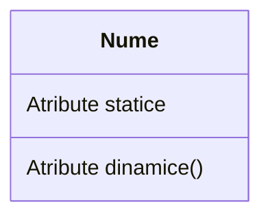
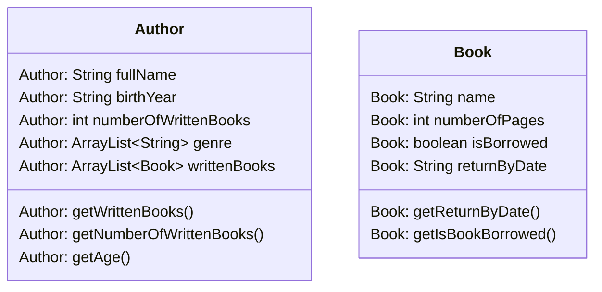
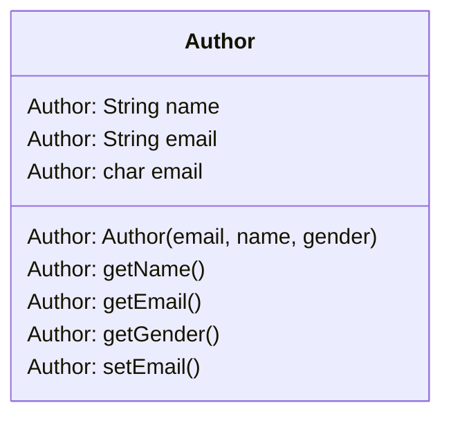
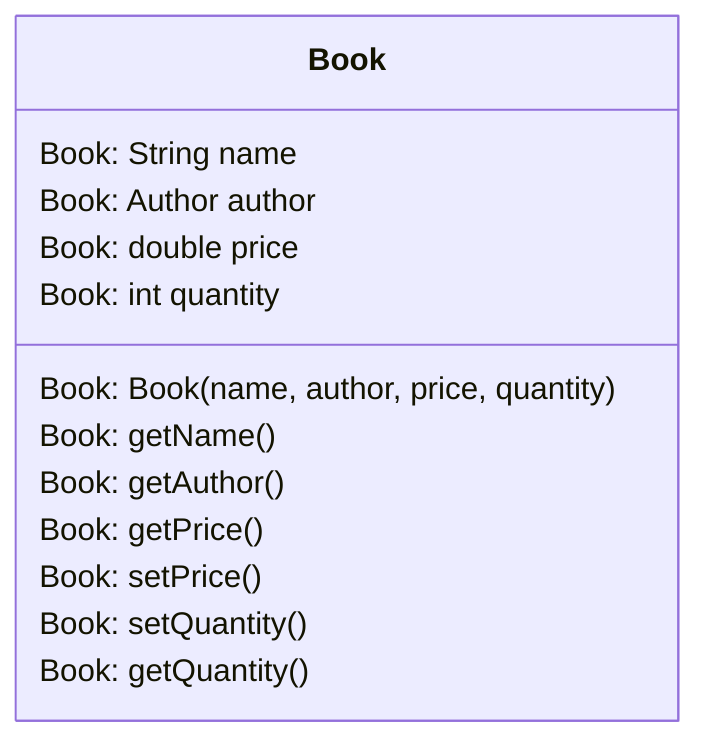
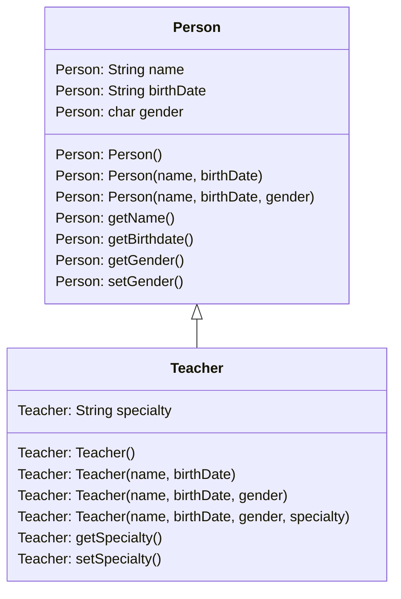

#  Bazele programării orientată pe obiect (OOP)

Să presupunem că doriți să vă asamblați propriul computer, mergeți la un magazin de hardware și luați o placă de bază, un procesor, câteva stick-uri de memorie RAM, un solid state drive (SSD), o carcasă, o sursă de alimentare și le puneți împreună. Porniți alimentarea și computerul pornește. Nu trebuie să vă faceți griji dacă procesorul este cu 1 sau 6 nuclee; placa de baza este cu 4 sau 6 straturi; RAM-ul este fabricat în Japonia sau Coreea și așa mai departe. Pur și simplu puneți componentele hardware împreună și vă așteptați să funcționeze. Desigur, trebuie să vă asigurați că aveți interfețele corecte, adică alegeți un SSD de tip M2 mai degrabă decât SSD de tip SATA, dacă placa de bază acceptă doar M2; trebuie să selectați RAM cu viteza corectă și așa mai departe. Cu toate acestea, nu este dificil să configurați o mașină din componente hardware.

Ce zici de software? Puteți „asambla” o aplicație software alegând o rutină aici, o rutină acolo și să vă așteptați ca programul să ruleze? Raspunsul este evident **nu**. Spre deosebire de hardware, este foarte dificil să „asamblezi” o aplicație din componente software. De la apariția computerului, acum ~70 de ani, am scris tone și tone de programe și rutine. Totuși, pentru fiecare nouă aplicație, trebuie să reinventăm roțile și să scriem programul de la zero.

Limbajele tradiționale de programare orientate către procedura (cum ar fi C, Fortran, Cobol și Pascal) suferă unele dezavantaje notabile în crearea de componente software reutilizabile:

* Programele procedurale sunt alcătuite din funcții. Funcțiile sunt mai puțin reutilizabile. Este foarte dificil să copiați o funcție dintr-un program și să o refolosiți într-un alt program, deoarece este probabil ca funcția să facă referire la variabilele globale și la alte funcții. Cu alte cuvinte, funcțiile nu sunt bine încapsulate ca o unitate reutilizabilă autonomă.
* Limbajele procedurale nu sunt potrivite pentru abstractizare la nivel înalt pentru rezolvarea problemelor din viața reală. De exemplu, programele C folosesc constructe precum ``if-else``, ``for-loop``, ``array``, ``method``, ``pointer``, care sunt probleme reale de nivel scăzut și greu de abstractizat, cum ar fi un sistem de management al relațiilor cu clienții (CRM) sau o bibliotecă pe computer.

Limbajele procedurale tradiționale separă structurile de date (variabile) și algoritmii (funcțiile).

### Programarea orientată pe obiect

Limbajele de programare orientată pe obiecte (OOP) sunt concepute pentru a depăși aceste probleme menționate anterior.

* Unitatea de bază a OOP este o clasă, care încapsulează atât proprietățile statice, cât și operațiile dinamice într-o „cutie” și specifică interfața publică pentru utilizarea acestora. Deoarece clasele sunt bine încapsulate, este mai ușor să reutilizați aceste clase. Cu alte cuvinte, OOP combină structurile de date și algoritmii unei entități software în interiorul aceleiași entități.
* Limbajele OOP permit un _nivel mai ridicat de abstractizare_ pentru rezolvarea problemelor din viața reală. Limbajul procedural tradițional (cum ar fi C și Pascal) vă obligă să gândiți în termeni de structura computerului (de exemplu, biți și octeți de memorie, matrice, decizie, buclă), mai degrabă decât să gândiți în termenii problemei pe care încercați să o rezolvați. Limbajele OOP (cum ar fi Java, C++ și C#) vă permit să gândiți în spațiul problemei și să utilizați **obiecte** pentru a reprezenta și a abstractiza entitățile din spațiul problemei pentru a rezolva problema.

De exemplu, să presupunem că doriți să scrieți un program pentru organizarea unei biblioteci. Este destul de dificil să modelezi programul în limbaje procedurale. Dar folosind limbaje OOP, puteți modela cu ușurință programul în funcție de „lucrurile reale” care apar într-o locație reală.

* **Utilizator**: nume, prenume, vârstă, nr. cărți împrumutate, etc.
* **Carte**: nume, autor, an publicare, etc.
* **Autor**: nume, nr. cărți scrise, gen, etc.

Cel mai important, unele dintre aceste clase (cum ar fi **Carte** sau **Autor**) pot fi reutilizate într-o altă aplicație, de exemplu, un magazin online de cărți, cu modificări reduse sau deloc.


### Beneficiile OOP

Limbile procedurale se concentrează pe proceduri, cu funcția ca unitate de bază. Mai întâi trebuie să vă dați seama de toate funcțiile și apoi să vă gândiți cum să reprezentați datele.

Limbajele orientate pe obiecte se concentrează pe componentele pe care utilizatorul le percepe, cu obiectele ca unitate de bază. Îți dai seama de toate obiectele punând toate datele și operațiile care descriu interacțiunea utilizatorului cu datele. 

Tehnologia orientată pe obiecte are multe avantaje:

* <u>Ușurință în proiectarea software-ului:</u> așa cum ați putea gândi în spațiul cu probleme, mai degrabă decât în biți și octeți ai mașinii. Aveți de-a face cu concepte și abstracții de nivel înalt. Ușurința în proiectare duce la o dezvoltare de software mai productivă

* <u>Ușurință în întreținerea software-ului:</u> software-ul orientat pe obiecte este mai ușor de înțeles, prin urmare mai ușor de testat, depanat și întreținut.
* <u>Software reutilizabil:</u> nu trebuie să continuați să reinventați roata și să rescrieți aceleași funcții pentru diferite situații. Cel mai rapid și mai sigur mod de a dezvolta o nouă aplicație este reutilizarea codurilor existente - cod complet testat și dovedit.


### OOP  în Java

În Java, o clasă este o definiție a obiectelor de același fel. Cu alte cuvinte, o clasă este un model, un șablon sau un prototip care definește și descrie atributele statice și comportamentele dinamice comune tuturor obiectelor de același fel.

O instanță este o realizare a unui anumit element al unei clase. Cu alte cuvinte, o instanță este o instanțiere a unei clase. Toate instanțele unei clase au proprietăți similare, așa cum este descris în definiția clasei. De exemplu, puteți defini o clasă numită „Autor” și puteți crea trei instanțe ale clasei „Autor” pentru „H.P Lovecraft”, „Haruki Murakami” și „Mary Shelley”.

Termenul „obiect” se referă de obicei la instanță. Dar este adesea folosit în mod liber și se poate referi la o clasă sau o instanță.

O clasă poate fi vizualizată ca o cutie cu trei compartimente, după cum este ilustrat:



* **Nume (sau identitate):** identifică clasa
* **Variabile (sau atribut, stare, câmp):** conține atributele statice ale clasei.
* **Metode (sau comportamente, funcție, operație):** conține comportamentele dinamice ale clasei.

Cu alte cuvinte, o clasă încapsulează într-o cutie **atributele statice** (date) și **comportamentele dinamice** (operațiile care operează pe date).

---

Figura următoare prezintă câteva exemple de clase:



#### De reținut

* O clasă este o entitate software definită de programator, abstractă, autonomă, reutilizabilă, care imită un lucru din lumea reală
* O clasă este o „cutie” cu 3 compartimente care conține numele, variabilele și metodele
* O clasă încapsulează **structurile de date** (în variabile) și **algoritmii** (în metode). Valorile variabilelor constituie starea acestuia. Metodele constituie comportamentele sale
* O instanță este o instanțiere (sau realizare) a unui anumit element al unei clase


### Definirea unei clase în Java

În Java, folosim cuvântul cheie class pentru a defini o clasă. De exemplu:

```java
public class Author { // Numele clasei
    private String fullName; // Variabile
    private String birthYear;
    private int numberOfWrittenBooks;
    private ArrayList<String> genres;
    private ArrayList<Book> writtenBooks;
    
    public int getNumberOfWrittenBooks() { } // Metode
    public ArrayList<String> getGenres() { }
    public ArrayList<Book> getWrittenBooks() { }
}

```

Sintaxa pentru definirea clasei în Java este:

```
[Modificator_de_acces] class numeleClasei {
	// Corpul clasei cu variabile și metode
}
```

---

### Modificatori de access

Un modificator de control al accesului poate fi utilizat pentru a controla vizibilitatea unei clase sau a unei variabile membre sau a unei metode de membru în cadrul unei clase.

Există **patru** tipuri de modificatori de acces Java:

| Modifcator de access | Access în interiorul clasei | Access în pachet | Access în exteriorul pachetului prin subclasă | Access în exteriorul pachetului |
| -------------------- | :-------------------------: | :--------------: | :-------------------------------------------: | :-----------------------------: |
| **Private**          |             Da              |        Nu        |                      Nu                       |               Nu                |
| **Default**          |             Da              |        Da        |                      Nu                       |               Nu                |
| **Protected**        |             Da              |        Da        |                      Da                       |               Nu                |
| **Public**           |             Da              |        Da        |                      Da                       |               Da                |

---

### Crearea instanțelor unei clase

Pentru a crea o instanță a unei clase, trebuie să:

* **Declarați** o instanță (nume de instanță) al unei anumite clase.
* **Construiți** instanța (adică, alocați spațiu de stocare pentru instanță și inițializați instanța) folosind operatorul ``new`` .

De exemplu, să presupunem că avem o clasa numită ``Author`` , putem crea instanțe de ``Author`` după cum urmează:

```java
public class Main {
    public static void main(String[] args) {
        // Declaram 3 instante ale clasei Author
        Author authorOne, authorTwo, authorThree; // Aceste obiecte retin o valoare numita null
        
        // Construim instante folosind operatorul new
        authorOne = new Author();
        authorTwo = new Author();
        authorThree = new Author();
        
        // Puteti declara si construi o instanta simultan
        Author authorFour = new Author();
    }
}

```

---

### Operatorul ``.``

Variabilele și metodele aparținând unei clase sunt denumite formal variabile membre și metode membre. Pentru a face referire la o variabilă sau o metodă membru, trebuie să:

* Mai întâi identificați instanța care vă interesează și apoi,
* Utilizați operatorul punct (`` .`` ) pentru a face referire la variabila sau metoda membru dorită.

De exemplu, să presupunem că avem o clasă numită ``Author`` , cu mai multe variabile membre ( ``fullName,`` ``birthDate ``, etc.) și mai multe metode membre ( ``setNumberOfWrittenBooks()`` , ``getWrittenBooks()`` ). Am creat trei instanțe ale clasei ``Author`` , și anume, ``authorOne`` , ``authorTwo`` și ``authorThree`` . Pentru a invoca metoda ``getWrittenBooks()`` trebuie mai întâi să identificați instanța de interes, să spunem ``secondAuthor`` , apoi să utilizați operatorul punct, sub forma ``secondAuthor.getWrittenBooks() ``.

```java
public class Main {
    public static void main(String[] args) {
        // Declaram doua instante ale clasei autor folosind constructorul
        Author firstAuthor = new Author();
        Author secondAuthor = new Author();
        
        // Invocam una din metodele clasei
        System.out.println(firstAuthor.getNumberOfWrittenBooks());
        System.out.println(secondAuthor.getWrittenBooks());
    }
}

```

---

### Constructor

Un **constructor** este o **<u>metodă specială care are același nume de metodă ca și numele clasei</u>**. Adică, constructorul clasei`` Author`` se numește ``Author`` . În clasa ``Author`` de mai jos, vom defini trei versiuni supraîncărcate ale constructorului ``Author(...)`` . Un constructor este folosit pentru a construi și inițializa variabilele membre. Pentru a construi o nouă instanță a unei clase, trebuie să utilizați operatorul special new urmat de un apel către unul dintre constructori. De exemplu:

```java
public class Author {
    private String fullName;
    private String birthYear;
    private int numberOfWrittenBooks;
    private ArrayList<String> genres;
    private ArrayList<Book> writtenBooks;
    
    // Primul constructor
    public Author() { }
    
    // Al doilea constructor
    public Author(String fullName, String birthYear) {
        this.fullName = fullName;
        this.birthYear = birthYear;
    }
    
    // Al treilea constructor
    public Author(String fullName, String birthYear, int numberOfWrittenBooks) {
        this.fullName = fullName;
        this.birthYear = birthYear;
        this.numberOfWrittenBooks = numberOfWrittenBooks;
    }
    
    public int getNumberOfWrittenBooks() {
    	return numberOfWrittenBooks;
    }
    
    public void setNumberOfWrittenBooks(int numberOfWrittenBooks) {
    	this.numberOfWrittenBooks = numberOfWrittenBooks;
    }
    
    public ArrayList<String> getGenres() {
    	return genres;
    }
    
    public void setGenres(ArrayList<String> genres) {
    	this.genres = genres;
    }
    
    public ArrayList<Book> getWrittenBooks() {
    	return writtenBooks;
    }
    
    public void setWrittenBooks(ArrayList<Book> writtenBooks) {
    	this.writtenBooks = writtenBooks;
    }
}

```

Acum vom folosi fiecare constructor pentru instanțierea a trei obiecte de tip ``Author``

```java
public class Main {
    public static void main(String[] args) {
        // Declaram doua instante ale clasei autor folosind constructorul
        Author firstAuthor = new Author();
        Author secondAuthor = new Author("Haruki Murakami", "1949");
        Author thirdAuthor = new Author("Mary Shelley", "1797", 32);
    }
}
```

O metodă de constructor este diferită de o metodă obișnuită în următoarele aspecte:

* Numele metodei constructorului trebuie să fie același cu numele clasei. După convenția numelui clasei, începe cu litere mari (în loc de litere mici pentru metodele obișnuite)
* Constructorul nu are niciun tip de returnare în antetul metodei sale. Se întoarce implicit gol. Nicio instrucțiune return nu este permisă în corpul constructorului
* Constructorul poate fi invocat numai prin operatorul ``new`` . Poate fi folosit o singură dată pentru a inițializa instanța construită. Odată ce o instanță este construită, nu mai puteți apela constructorul
* Constructorii nu sunt moșteniți (vor fi explicați mai târziu). Fiecare clasă își va defini propriii constructori

**Constructor implicit (default):** Un constructor fără parametru este numit constructor implicit. Inițializează variabilele membre la valorile lor implicite. De exemplu, ``Author()`` din exemplul de mai sus inițializează raza și culoarea variabilelor membre la valorile implicite.

---

### Cuvântul cheie ``this``

Puteți folosi cuvântul cheie ``this`` pentru a face referire la **această** instanță în cadrul unei definiții de clasă. Una dintre principalele utilizări ale cuvântului cheie este pentru a rezolva ambiguitatea.

```java
public class Author {
    private String fullName; // membru al clasei numit "fullName"
        public Author(String fullName) { // parametru in constructor numit la fel "fullName"
        this.fullName = fullName;
        // "fullName = fullName" nu are avea sens
        // "this.fullName" se refera la ACEST membru al clasei
        // "fullName" acum se intelege ca este parametrul metodei
    }
}

```

În codul de mai sus, există doi identificatori numiți ``fullName`` - o variabilă membru a clasei și parametrul metodei. Acest lucru provoacă conflict de denumire. Pentru a evita conflictul de denumire, puteți numi argumentul metodei name în loc de ``fullName`` . Cu toate acestea, ``fullName`` este mai semnificativă în acest context. Java furnizează un cuvânt cheie numit this pentru a rezolva acest conflict de denumire. ``this.fullName`` se referă la variabila membru; în timp ce ``fullName`` se rezolvă la argumentul metodei.

Mai multe despre ``this``

* ``this.varName`` se referă la ``varName`` al acestei instanțe; ``this.methodName(...)`` apelează ``methodName(...)`` a acestei instanțe.
* Într-un constructor, putem folosi ``this(...)`` pentru a apela un alt constructor al acestei clase.
* În interiorul unei metode, putem folosi instrucțiunea ``return this`` pentru a returna această instanță apelantului.

---

### Overloading

**Supraîncărcarea** metodei înseamnă că același nume de metodă poate avea implementări (versiuni) diferite. Totuși, diferitele implementări trebuie să fie distinse prin lista lor de parametri (fie numărul de parametri, fie tipul de parametri, fie ordinea acestora).

```java
public class Author {
    private String fullName;
    private String birthYear;
    private int numberOfWrittenBooks;
    // Primul constructor
    public Author() { }
    
    // Al doilea constructor
    public Author(String fullName, String birthYear) {
        this.fullName = fullName;
        this.birthYear = birthYear;
    }
    
    // Al treilea constructor
    public Author(String fullName, String birthYear, int numberOfWrittenBooks) {
        this.fullName = fullName;
        this.birthYear = birthYear;
        this.numberOfWrittenBooks = numberOfWrittenBooks;
    }
}
```

---

### Encapsulation

O clasă încapsulează numele, atributele statice și comportamentele dinamice într-o „cutie cu 3 compartimente”. Odată ce o clasă este definită, puteți sigila „cutia” și puneți „cutia” pe raft pentru ca alții să o utilizeze și să o refolosească. Oricine poate ridica „cutia” și o poate folosi în aplicația sa. Acest lucru nu se poate face în limbajele procedurale, cum ar fi C, deoarece atributele (sau variabilele) statice sunt împrăștiate pe întregul program și fișierele antet. Nu puteți „decupa” o porțiune din programul C, conectați-vă la un alt program și așteptați ca programul să ruleze fără modificări ample.

Variabilele membre ale unei clase sunt de obicei ascunse de cuvântul exterior (adică, celelalte clase), cu modificatorul de control al accesului privat. Accesul la variabilele membrilor este asigurat prin metode de evaluator public, e.g ``getNumberOfWrittenBooks()`` sau ``getWrittenBooks()``

Aceasta urmează principiul **<u>ascunderii informațiilor</u>**. Adică, obiectele comunică între ele folosind interfețe bine definite (metode publice). Obiectele nu au voie să cunoască detaliile de implementare ale altora. Detaliile implementării sunt ascunse sau **încapsulate** în clasă. Ascunderea informațiilor facilitează reutilizarea clasei.

**Regula generală:** nu faceți publice nicio variabilă, decât dacă aveți un motiv întemeiat.

---

### Composition & Inheritance

Există două moduri de a reutiliza clasele existente, și anume, **compoziția** și **moștenirea**. Prin compoziție, definiți o nouă clasă, care este <u>compusă</u> din <u>clase existente</u>. Prin <u>moștenire</u>, obțineți <u>o nouă clasă bazată pe o clasă existentă</u>, cu modificări sau extensii.

Vom începe cu reutilizarea claselor prin compoziție - prin exemple.



O clasă numită ``Author`` este proiectată așa cum se arată în diagrama de clasă. Contine:

* Trei variabile private: ``name ``(String), ``email`` (String) și ``gender``(„m” sau „f”)
* Un **constructor** pentru a inițializa numele, e-mailul și sexul cu valorile date.
  (Nu există un constructor implicit, deoarece nu există o valoare implicită pentru nume, e-mail și sex.)
* Getters/setters publici: ``getName()``, ``getEmail()``, ``setEmail()`` și ``getGender()``.
  (Nu există setari pentru nume și sex, deoarece aceste proprietăți nu sunt concepute pentru a fi modificate.)

```java
public class Author {
   // Variabilele private
   private String name;
   private String email;
   private char gender;   // 'm' sau 'f'
 
   /** Constructorul pentur instantele de Author care vor lua 3 parametrii */
   public Author(String name, String email, char gender) {
      this.name = name;
      this.email = email;
      this.gender = gender;
   }
 
   // Getter si setter publici folositi pentru a modifica si accesa valorile instantei.
   // Nu avem setter pentru nume si gen doarece prin design, nu vom modifica aceste valori.
   /** Returneaza un string ca nume */
   public String getName() {
      return name;
   }
   /** Returneaza un caracter ca gen */
   public char getGender() {
      return gender;
   }
   /** Returneaza emailul ca string */
   public String getEmail() {
      return email;
   }
   /** Seteaza valoarea emailului */
   public void setEmail(String email) {
      this.email = email;
   }
    
    @Override
    public String toString() {
        return name + ", " + email + ", " + gender;
    }
}
```

Să proiectăm o clasă de carte. Să presupunem că o carte este scrisă de un (și exact unul) autor. 




Clasa ``Book`` (așa cum se arată în diagrama de clasă) conține următorii membri:

* Patru variabile membre private: ``name ``(``String``), ``author`` (o instanță a clasei ``Author`` pe care tocmai am creat-o, presupunând că fiecare carte are exact un autor), ``price`` (``double``) și ``quantity``(``int``).
* Getterii și setarii publici: ``getName()``,`` getAuthor()``, ``getPrice()``, ``setPrice()``, ``getQty()``, ``setQty()``.

```java
public class Book {
   // Variabile private
   private String name;
   private Author author;
   private double price;
   private int qty;
 
   /** Constructorul folosit pentru a genera o instanta de tip Book care primeste ca si parametru un obiect de tip Author*/
   public Book(String name, Author author, double price, int qty) {
      this.name = name;
      this.author = author;
      this.price = price;
      this.qty = qty;
   }
 
   // Getters and Setters
   /** Returneaza numele cartii */
   public String getName() {
      return name;
   }
   /** Returneaza o instanta a clasei author */
   public Author getAuthor() {
      return author;  // returneaza obiectul membru author care este o instanta a clasei Author
   }
   /** Returneaza pretul */
   public double getPrice() {
      return price;
   }
   /** Seteaza o valoare pentru pret */
   public void setPrice(double price) {
      this.price = price;
   }
   /** Returneaza cantitatea */
   public int getQty() {
      return qty;
   }
   /** Seteaza cantitatea */
   public void setQty(int qty) {
      this.qty = qty;
   }
  
   @Override
   public String toString() {
      return "Book{" +
                "name='" + name + '\'' +
                ", author=" + author +
                ", price=" + price +
                ", qty=" + qty +
                '}';
    }
}
```

Exemplu pentru clasa ``Main.java``

```java
public class Main {
    public static void main(String[] args) {
        // Mai intai avem nevoie de un autor pentru a creea o instanta de 'Book'
        Author firstAuthor = new Author("Haruki Murakami", "haruki.murakami@gmail.com", 'm');
        System.out.println(firstAuthor);  // Prin printarea obiectului, apelam automat metoda de toString()
        // Output: Haruki Murakami, haruki.murakami@gmail.com, m

        // Acum putem creea o instanta a clasei 'Book'
        Book firstBook = new Book("Kafka on the shore", firstAuthor, 29.99, 100);
        System.out.println(firstBook);  // Prin printarea obiectului, apelam automat metoda de toString()
        // Kafka on the shore de Haruki Murakami, haruki.murakami@gmail.com, m la pretul de 29.99 RON; 100(Cantitatea curenta)

        //Setters si Getters
        firstBook.setPrice(8.88);
        firstBook.setQty(88);
        System.out.println("Numele este: " + firstBook.getName());
        System.out.println("Pretul este: " + firstBook.getPrice());
        System.out.println("Cantitatea este: " + firstBook.getQty());
        System.out.println("Autorul este: " + firstBook.getAuthor());  // Folosim toString() al clasei Author
        //author is: Haruki Murakami, haruki.murakami@gmail.com, m
        System.out.println("Numele autorului este: " + firstBook.getAuthor().getName());
        //author's name is: Haruki Murakami
        System.out.println("Emailul autorului este: " + firstBook.getAuthor().getEmail());
        //author's email is: haruki.murakami@gmail.com
        System.out.println("Genul autorului este: " + firstBook.getAuthor().getGender());
        //author's gender is: m

        // Putem folosi un obiect creat direct în constructor
        Book secondBook = new Book("The prince",
                new Author("Niccolo Machiavelli", "-", 'm'),
                10.99, 10);
        System.out.println(secondBook);  // Folosim metoda de toString() a clasei Book
        // The prince de Niccolo Machiavelli, -, m la pretul de 10.99 RON; 10(Cantitatea curenta)
    }
}
```

În OOP, organizăm adesea clase în ierarhie pentru a evita dublarea și pentru a <u>reduce redundanța</u>. Clasele din ierarhia inferioară moștenesc toate **variabilele** (atribute statice) și **metodele** (comportamente dinamice) din ierarhiile superioare. O clasă din ierarhia inferioară se numește **subclasă** (sau derivată, copil, clasă extinsă). O clasă din ierarhia superioară se numește **superclasă** (sau clasă de bază, părinte). Prin extragerea tuturor variabilelor și metodelor comune în superclase și lăsând variabilele și metodele specializate în subclase, redundanța poate fi mult redusă sau eliminată, deoarece aceste variabile și metode comune nu trebuie repetate în toate subclasele.

O subclasă moștenește toate variabilele și metodele din superclasele sale, inclusiv părintele imediat, precum și toți strămoșii. Este important de reținut că o subclasă nu este un „subset” al unei superclase. În schimb, subclasa este un „superset” al unei superclase. Se datorează faptului că o subclasă moștenește toate variabilele și metodele superclasei; în plus, extinde superclasa oferind mai multe variabile și metode.

În Java, definiți o subclasă folosind cuvântul cheie ``extends``, de exemplu:

```java
public class Teacher extends Person { ... }
public class Student extends Person { ... }
```

### Exemplu



În acest exemplu, derivăm o subclasă numită ``Teacher`` din superclasa ``Person``. Este important de reținut că reutilizam clasa ``Person``. Reutilizarea este una dintre cele mai importante proprietăți ale POO. (De ce să reinventezi roata?) Clasa ``Teacher`` moștenește toate **variabilele membre** (``name``, ``birthDate`` și ``gender``) și **metodele** (``getName()``, ``getBirthDate()``, etc.) din superclasa ``Person``. Definește în continuare o variabilă numită ``speciality``, două metode publice - ``getSpecialty()``și ``setSpecialty()``și <u>proprii săi constructori</u>, după cum se arată:

```java
package com.company;

public class Person {
    // Variabile private
    private String name;
    private String birthDate;
    private char gender;

    // Constructori
    public Person() {
        this.name = "";
        this.birthDate = "";
        this.gender = '\0';
    }

    public Person(String name, String birthDate) {
        this.name = name;
        this.birthDate = birthDate;
    }

    public Person(String name, String birthDate, char gender) {
        this.name = name;
        this.birthDate = birthDate;
        this.gender = gender;
    }

    // Getter si Setter
    public String getName() {
        return name;
    }

    public String getBirthDate() {
        return birthDate;
    }

    public char getGender() {
        return gender;
    }

    public void setGender(char gender) {
        this.gender = gender;
    }

    @Override
    public String toString() {
        return "Name: " + name +
                "\nBirthdate: " + birthDate +
                "\nGender: " + gender;
    }
}
```

```java
package com.company;

public class Teacher extends Person {
    // Variabile private
    private String specialty;

    // Constructori
    public Teacher() {
        super();
        specialty = "";
    }

    public Teacher(String name, String birthDate, String specialty) {
        super(name, birthDate);
        this.specialty = specialty;
    }

    public Teacher(String name, String birthDate, char gender, String specialty) {
        super(name, birthDate, gender);
        this.specialty = specialty;
    }

    // Getter si Setter
    public String getSpecialty() {
        return specialty;
    }

    public void setSpecialty(String specialty) {
        this.specialty = specialty;
    }

    @Override
    public String toString() {
        return "Name: " + super.getName() +
                "\nBirthdate: " + super.getBirthDate() +
                "\nGender: " + super.getBirthDate() +
                "\nSpecialty: " + specialty;
    }
}

```

```java
public class Main {
    public static void main(String[] args) {
        // Test constructors and toString()
        Person person = new Person("Andrei Cojoc", "01-05-1984");
        System.out.println(person);  // toString()
        Person secondPerson = new Person();  // default constructor
        System.out.println(secondPerson);
        // Test Setters and Getters
        person.setGender('m');  // Test setters
        System.out.println(person);  // toString()
        System.out.println("Genul este: " + person.getGender());


        // Test constructors and toString()
        Teacher teacher = new Teacher("Patrichi Alina", "25-10-1977", "Computer Science");
        System.out.println(teacher);  // toString()
        Teacher secondTeacher = new Teacher();  // default constructor
        System.out.println(secondTeacher);
        // Test Setters and Getters
        teacher.setGender('F');  // in superclass
        teacher.setSpecialty("Informatics");  // in propria clasa
        System.out.println(teacher);  // toString()
        System.out.println("Numele este: " + teacher.getName());  // in superclass
        System.out.println("Ziua de nastere este: " + teacher.getBirthDate());  // in superclass
        System.out.println("Specializarea este: " + teacher.getSpecialty());  // in propria clasa
    }
}
```

**Regula generală:** Folosiți compoziția dacă este posibil, înainte de a lua în considerare moștenirea. Folosiți moștenirea numai dacă există o relație ierarhică clară între clase.

### Polymorphism

Cuvântul „polimorfism” înseamnă „*multe forme*”. Provine din cuvântul grecesc „poli” (mulți) și „morphos” (formă). De exemplu, în chimie, carbonul prezintă polimorfism deoarece poate fi găsit sub mai multe forme: grafit și diamant. Dar, fiecare formular are propriile proprietăți distincte.

Polimorfismul este foarte puternic în OOP pentru a separa interfața și implementarea, astfel încât să permită programatorului să programeze la interfață în proiectarea unui sistem complex.

Luați în considerare următorul exemplu. Să presupunem că programul nostru folosește multe tipuri de forme, cum ar fi triunghi, dreptunghi și așa mai departe. Ar trebui să proiectăm o superclasă numită ``Shape``, care definește interfețele publice (sau comportamentele) tuturor formelor. De exemplu, am dori ca toate formele să aibă o metodă numită ``getArea()``, care returnează aria acelei forme particulare. Clasa ``Shape`` poate fi scrisă după cum urmează.

````mermaid
classDiagram
	class Shape {
		Shape: String colour
		Shape: getArea() double
		Shape: toString() String
	}
	
	class Rectangle {
		Rectangle: int length
		Rectangle: int width
		Rectangle: getArea() double
		Rectangle: toString() String
	}
	
	class Triangle {
		Triangle: int base
		Triangle:  int height
		Triangle: getArea() double
		Triangle: toString() String
	}
	
	Shape <|-- Rectangle
	Shape <|-- Triangle
````

```java
public class Shape {
   // Variabile private
   private String color;
   
   /** Construim o forma folosind culoarea care ne este data ca si parametru in constructor */
   public Shape (String color) {
      this.color = color;
   }

   /** Returnam o scurta descriere */   
   @Override
   public String toString() {
      return "Shape[color=" + color + "]";
   }
   
   /** Toate formele trebuie sa vina cu o implementare pentru metoda de getArea() */
   public double getArea() {
      // Deoarece metoda ne obliga sa returnam ceva, vom afisa doar un mesaj de eroare si vom returna 0.
      System.err.println("Shape unknown! Cannot compute area!");
      return 0;
   }
}
```

Rețineți că avem o problemă la scrierea metodei ``getArea()`` în clasa ``Shape``, deoarece aria nu poate fi calculată decât dacă forma reală este cunoscută. Vom printa un mesaj de eroare pentru moment. În secțiunea ulterioară, vă voi arăta cum să rezolvați această problemă.

```java
public class Rectangle extends Shape {
   // Variabile private
   private int length, width;
   
   /** Construim un dreptunghi folosind culoarea, lungimea si latimea care ne este data ca si parametru in constructor */
   public Rectangle(String color, int length, int width) {
      super(color);
      this.length = length;
      this.width = width;
   }

   /** Returnam o scurta descriere */    
   @Override
   public String toString() {
      return "Rectangle[length=" + length + ",width=" + width + "," + super.toString() + "]";
   }
   
   /** Suprascriem metoda mostenita de getArea() ca sa venim cu implementarea adecvata unui dreptunghi */
   @Override
   public double getArea() {
      return length * width;
   }
}
```

```java
public class Triangle extends Shape {
   // Variabile private
   private int base, height;
   
    /** Construim un dreptunghi folosind culoarea, baza si inaltimea care ne este data ca si parametru in constructor */
   public Triangle(String color, int base, int height) {
      super(color);
      this.base = base;
      this.height = height;
   }
   
   /** Returnam o scurta descriere */   
   @Override
   public String toString() {
      return "Triangle[base=" + base + ",height=" + height + "," + super.toString() + "]";
   }
   
   /** Suprascriem metoda mostenita de getArea() ca sa venim cu implementarea adecvata unui triunghi */
   @Override
   public double getArea() {
      return 0.5 * base * height;
   }
}
```

Subclasele suprascrie metoda ``getArea()`` moștenită de la superclasă și oferă implementările adecvate pentru ``getArea()``.

```java
public class Main {
    public static void main(String[] args) {
        Rectangle rectangle = new Rectangle("Red", 4, 5);
        System.out.println(rectangle);
        //Rectangle[length=4,width=5,Shape[color=red]]
        System.out.println("Area is " + rectangle.getArea());  // Apelam getArea() al dreptunghiului
        //Aria este 20.0

        Triangle triangle = new Triangle("blue", 4, 5);
        System.out.println(triangle);
        //Triangle[base=4,height=5,Shape[color=blue]]
        System.out.println("Area is " + triangle.getArea());  // Apelam getArea() al triunghiului
        //Aria este 10.0
    }
}
```

Frumusețea acestui cod este că toate referințele sunt din superclasă (adică, programarea la nivel de interfață). Puteți instanția o altă instanță de subclasă, iar codul încă funcționează. Vă puteți extinde cu ușurință programul adăugând mai multe subclase, cum ar fi ``Circle``, ``Square`` etc., cu ușurință.