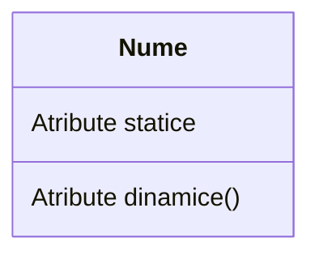
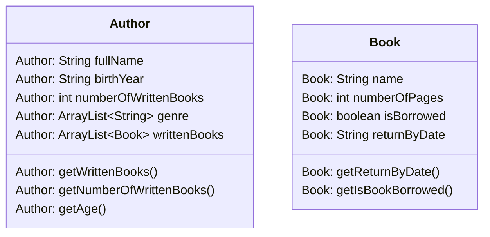

#  Bazele programării orientată pe obiect (OOP)

Să presupunem că doriți să vă asamblați propriul computer, mergeți la un magazin de hardware și luați o placă de bază, un procesor, câteva stick-uri de memorie RAM, un solid state drive (SSD), o carcasă, o sursă de alimentare și le puneți împreună. Porniți alimentarea și computerul pornește. Nu trebuie să vă faceți griji dacă procesorul este cu 1 sau 6 nuclee; placa de baza este cu 4 sau 6 straturi; RAM-ul este fabricat în Japonia sau Coreea și așa mai departe. Pur și simplu puneți componentele hardware împreună și vă așteptați să funcționeze. Desigur, trebuie să vă asigurați că aveți interfețele corecte, adică alegeți un SSD de tip M2 mai degrabă decât SSD de tip SATA, dacă placa de bază acceptă doar M2; trebuie să selectați RAM cu viteza corectă și așa mai departe. Cu toate acestea, nu este dificil să configurați o mașină din componente hardware.

Ce zici de software? Puteți „asambla” o aplicație software alegând o rutină aici, o rutină acolo și să vă așteptați ca programul să ruleze? Raspunsul este evident **nu**. Spre deosebire de hardware, este foarte dificil să „asamblezi” o aplicație din componente software. De la apariția computerului, acum ~70 de ani, am scris tone și tone de programe și rutine. Totuși, pentru fiecare nouă aplicație, trebuie să reinventăm roțile și să scriem programul de la zero.

Limbajele tradiționale de programare orientate către procedura (cum ar fi C, Fortran, Cobol și Pascal) suferă unele dezavantaje notabile în crearea de componente software reutilizabile:

* Programele procedurale sunt alcătuite din funcții. Funcțiile sunt mai puțin reutilizabile. Este foarte dificil să copiați o funcție dintr-un program și să o refolosiți într-un alt program, deoarece este probabil ca funcția să facă referire la variabilele globale și la alte funcții. Cu alte cuvinte, funcțiile nu sunt bine încapsulate ca o unitate reutilizabilă autonomă.
* Limbajele procedurale nu sunt potrivite pentru abstractizare la nivel înalt pentru rezolvarea problemelor din viața reală. De exemplu, programele C folosesc constructe precum ``if-else``, ``for-loop``, ``array``, ``method``, ``pointer``, care sunt probleme reale de nivel scăzut și greu de abstractizat, cum ar fi un sistem de management al relațiilor cu clienții (CRM) sau o bibliotecă pe computer.

Limbajele procedurale tradiționale separă structurile de date (variabile) și algoritmii (funcțiile).

### Programarea orientată pe obiect

Limbajele de programare orientată pe obiecte (OOP) sunt concepute pentru a depăși aceste probleme menționate anterior.

* Unitatea de bază a OOP este o clasă, care încapsulează atât proprietățile statice, cât și operațiile dinamice într-o „cutie” și specifică interfața publică pentru utilizarea acestora. Deoarece clasele sunt bine încapsulate, este mai ușor să reutilizați aceste clase. Cu alte cuvinte, OOP combină structurile de date și algoritmii unei entități software în interiorul aceleiași entități.
* Limbajele OOP permit un _nivel mai ridicat de abstractizare_ pentru rezolvarea problemelor din viața reală. Limbajul procedural tradițional (cum ar fi C și Pascal) vă obligă să gândiți în termeni de structura computerului (de exemplu, biți și octeți de memorie, matrice, decizie, buclă), mai degrabă decât să gândiți în termenii problemei pe care încercați să o rezolvați. Limbajele OOP (cum ar fi Java, C++ și C#) vă permit să gândiți în spațiul problemei și să utilizați **obiecte** pentru a reprezenta și a abstractiza entitățile din spațiul problemei pentru a rezolva problema.

De exemplu, să presupunem că doriți să scrieți un program pentru organizarea unei biblioteci. Este destul de dificil să modelezi programul în limbaje procedurale. Dar folosind limbaje OOP, puteți modela cu ușurință programul în funcție de „lucrurile reale” care apar într-o locație reală.

* **Utilizator**: nume, prenume, vârstă, nr. cărți împrumutate, etc.
* **Carte**: nume, autor, an publicare, etc.
* **Autor**: nume, nr. cărți scrise, gen, etc.

Cel mai important, unele dintre aceste clase (cum ar fi **Carte** sau **Autor**) pot fi reutilizate într-o altă aplicație, de exemplu, un magazin online de cărți, cu modificări reduse sau deloc.


### Beneficiile OOP

Limbile procedurale se concentrează pe proceduri, cu funcția ca unitate de bază. Mai întâi trebuie să vă dați seama de toate funcțiile și apoi să vă gândiți cum să reprezentați datele.

Limbajele orientate pe obiecte se concentrează pe componentele pe care utilizatorul le percepe, cu obiectele ca unitate de bază. Îți dai seama de toate obiectele punând toate datele și operațiile care descriu interacțiunea utilizatorului cu datele. 

Tehnologia orientată pe obiecte are multe avantaje:

* <u>Ușurință în proiectarea software-ului:</u> așa cum ați putea gândi în spațiul cu probleme, mai degrabă decât în biți și octeți ai mașinii. Aveți de-a face cu concepte și abstracții de nivel înalt. Ușurința în proiectare duce la o dezvoltare de software mai productivă

* <u>Ușurință în întreținerea software-ului:</u> software-ul orientat pe obiecte este mai ușor de înțeles, prin urmare mai ușor de testat, depanat și întreținut.
* <u>Software reutilizabil:</u> nu trebuie să continuați să reinventați roata și să rescrieți aceleași funcții pentru diferite situații. Cel mai rapid și mai sigur mod de a dezvolta o nouă aplicație este reutilizarea codurilor existente - cod complet testat și dovedit.


### OOP  în Java

În Java, o clasă este o definiție a obiectelor de același fel. Cu alte cuvinte, o clasă este un model, un șablon sau un prototip care definește și descrie atributele statice și comportamentele dinamice comune tuturor obiectelor de același fel.

O instanță este o realizare a unui anumit element al unei clase. Cu alte cuvinte, o instanță este o instanțiere a unei clase. Toate instanțele unei clase au proprietăți similare, așa cum este descris în definiția clasei. De exemplu, puteți defini o clasă numită „Autor” și puteți crea trei instanțe ale clasei „Autor” pentru „H.P Lovecraft”, „Haruki Murakami” și „Mary Shelley”.

Termenul „obiect” se referă de obicei la instanță. Dar este adesea folosit în mod liber și se poate referi la o clasă sau o instanță.

O clasă poate fi vizualizată ca o cutie cu trei compartimente, după cum este ilustrat:



* **Nume (sau identitate):** identifică clasa
* **Variabile (sau atribut, stare, câmp):** conține atributele statice ale clasei.
* **Metode (sau comportamente, funcție, operație):** conține comportamentele dinamice ale clasei.

Cu alte cuvinte, o clasă încapsulează într-o cutie **atributele statice** (date) și **comportamentele dinamice** (operațiile care operează pe date).

---

Figura următoare prezintă câteva exemple de clase:



#### De reținut

* O clasă este o entitate software definită de programator, abstractă, autonomă, reutilizabilă, care imită un lucru din lumea reală
* O clasă este o „cutie” cu 3 compartimente care conține numele, variabilele și metodele
* O clasă încapsulează **structurile de date** (în variabile) și **algoritmii** (în metode). Valorile variabilelor constituie starea acestuia. Metodele constituie comportamentele sale
* O instanță este o instanțiere (sau realizare) a unui anumit element al unei clase


### Definirea unei clase în Java

În Java, folosim cuvântul cheie class pentru a defini o clasă. De exemplu:

```java
public class Author { // Numele clasei
    private String fullName; // Variabile
    private String birthYear;
    private int numberOfWrittenBooks;
    private ArrayList<String> genres;
    private ArrayList<Book> writtenBooks;
    
    public int getNumberOfWrittenBooks() { } // Metode
    public ArrayList<String> getGenres() { }
    public ArrayList<Book> getWrittenBooks() { }
}

```

Sintaxa pentru definirea clasei în Java este:

```
[Modificator_de_acces] class numeleClasei {
	// Corpul clasei cu variabile și metode
}
```

---

### Modificatori de access

Un modificator de control al accesului poate fi utilizat pentru a controla vizibilitatea unei clase sau a unei variabile membre sau a unei metode de membru în cadrul unei clase.

Există **patru** tipuri de modificatori de acces Java:

| Modifcator de access | Access în interiorul clasei | Access în pachet | Access în exteriorul pachetului prin subclasă | Access în exteriorul pachetului |
| -------------------- | :-------------------------: | :--------------: | :-------------------------------------------: | :-----------------------------: |
| **Private**          |             Da              |        Nu        |                      Nu                       |               Nu                |
| **Default**          |             Da              |        Da        |                      Nu                       |               Nu                |
| **Protected**        |             Da              |        Da        |                      Da                       |               Nu                |
| **Public**           |             Da              |        Da        |                      Da                       |               Da                |

---


